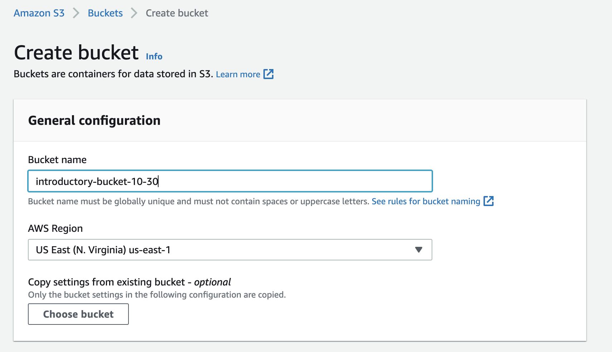
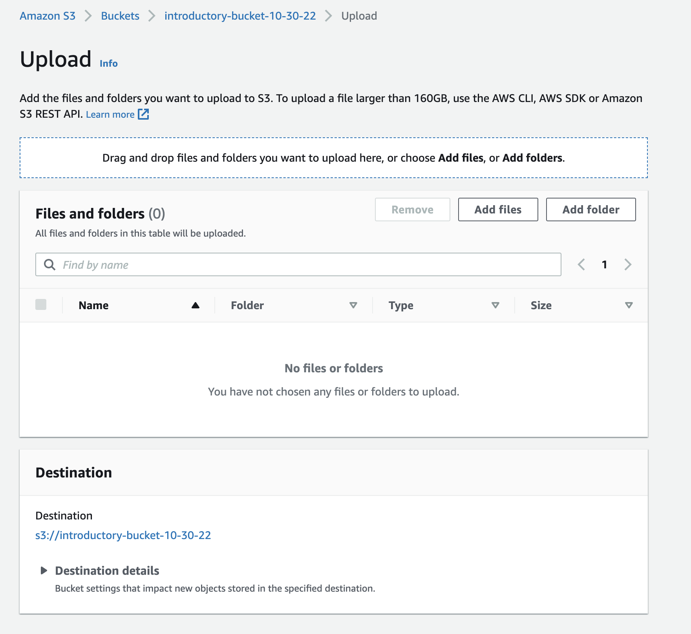
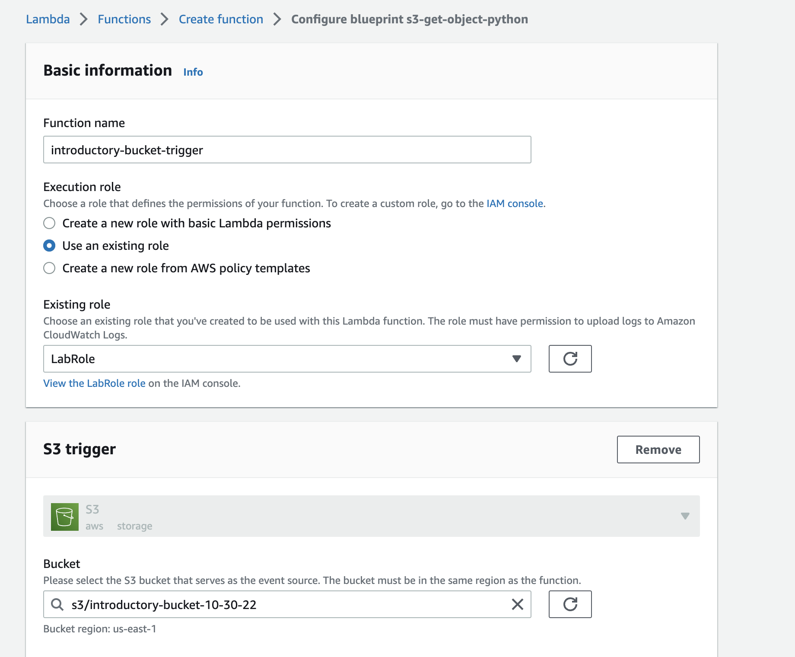
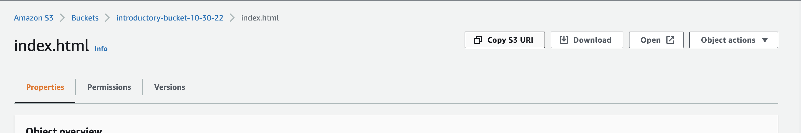

# Lecture - DevOps Introductory Lab


# DevOps Beginner Tutorial

This repository contains the introductory to DevOps lab for first time DevOps students

## S3 Bucket

AWS Services Used:

- S3
    - Create a static website hosted in an S3 bucket
- Lambda
    - Create a function that triggers a response when an object is added or updated to the S3 bucket

---

## Project Structure

The infrastructure for project is defined below:

```bash
├── README.md <------------- This guide to the project.
├── lambda_function.py <------------ lambda function created from lambda blueprint
├── index.html <------------ simple HTML page to upload to S3
├── bucket-policy.json <------------ bucket policy for S3
├── me.jpeg <----------- image of yourself to upload to S3
└── images <---------- folder directory for images
```
---

### Prerequisites:

- IAM User Configured with the correct S3 and Lambda permissions
- An image of yourself to replace the me.jpeg
- This github repository in your local environment

---

## AWS S3: Create Bucket

- Login to AWS Console and navigate to S3.
- Create a public new bucket:




---

## AWS S3: Edit Bucket

- Edit the bucket permissions to allow public access to your files.
- Edit the bucket-policy.json file by changing the "name-of-bucket" to the name of your bucket.

---

## AWS S3: Upload to Bucket

- Upload a picture to the bucket of you named me.jpeg
- Upload the index.html file to the bucket.



---

## AWS Lambda: Create an Lambda Function

We will now be creating a Lambda function that will trigger when the file is uploaded.

- Create Lambda function using the AWS blueprint with the following properties:


- Add your S3 bucket as the trigger:


---

## AWS S3: Upload Edited files to the Bucket

- Edit the index.html with information about you.
- Upload the index.html file to the bucket.
- Copy the S3 URI url


---

## AWS Lambda: Check the Logs

- On the Lambda page, click on Monitoring


- You will see your lambda function being triggered whenever a new updated file is uploaded to S3. 

---

# Last Step: With your table, share your link and introduce yourself!